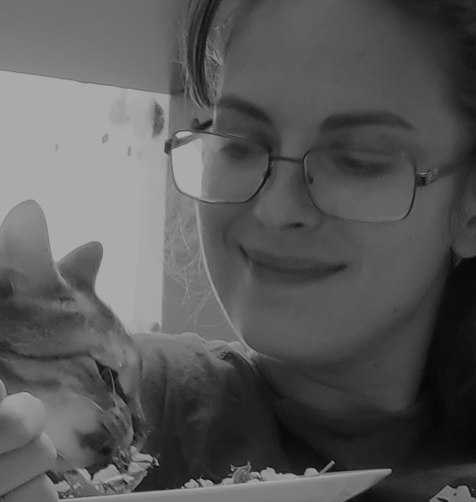

# Yuliya Mironava

I am _beginner front-end developer_ from Belarus, which is living in Wroclaw now.
I'm searching for knowledge about how it works, how I can make workable webpages by myself.

> I am already completed 2 weeks courses for beginners from **Ukranium school GoIT** (online). Also I made a small project for _**Fundacia WiWa** (children with cancer)_.

- The main benefits for me:
  - find an interesting job for all my live
  - have enought money to buy own car
  - make social web sites about insults, homless, animals, children...

#### That's why I am very motivated person:)!

### My contacts:

**E:** *rabkevich15@gmail.com*\
**Tel:** _+48-515-412-099_\
**Viber/ Wats up:** _+375-29-269-45-03_

##### Soft skills

- nice
- clever
- tolerant
- brave

###### My waiting

1. interesting tasks
2. knowledge
3. understanding how it's work
4. cool teacher
5. salary after 12 mounth hard learning

## Front-End Developer (beginner)

## Projects:

1. [Fundacia WiWa](https://stupefied-jepsen-ef824c.netlify.app/) \_\_\_ [2021]
2. [CV-Mironava](https://affectionate-agnesi-6b360b.netlify.app/) \_\_\_ [2021]
3. About insults _(working)_ \_\_\_ [2022]

### My experience

**February 2021 starting live in Poland.**\
Mowing with husband, 6 years child and cat. Learn polish, JS, Git in the same time.

- have to change profession to Frond-end developer
- have to make ours live comfortable
- have to find friends around
- have to speak Polish language

#### I worked in Gospromnadzor (before August 2020)

We helped factories to work safety for around and for people (with boilers). Also we made other important work:

- changed oxygen stations at hospitals
- improved cubmasters for making metal at "Minskaia bearing factory"
- made automation system for data collection on Microsoft excel

#### SST Bartec (2012-2018)

It was cool and great experience with clever teacher.

- learned how make a correct contract with customer
- learned how works electricity lines
- made a projects in team about heating systems

### My education

_Belorussian National Technology University, Minsk_

Power supply engineer, 2011

1. Master degree in power energetics, 2012
2. Logistick faculty (evening learning), 2011
3. **GoIT courses** (2 weeks), 2021
4. **English A2** (I have to learn it to get a master degree in 2011)

```
 PS: the road will be mastered by the walking
```


